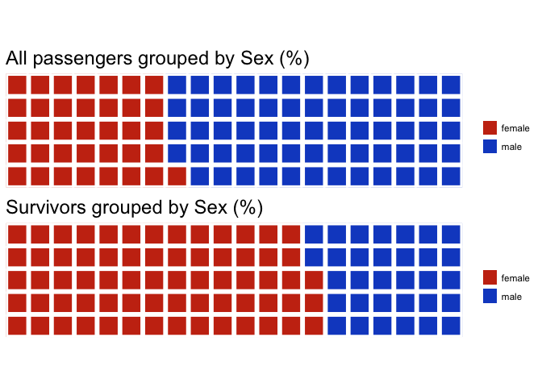
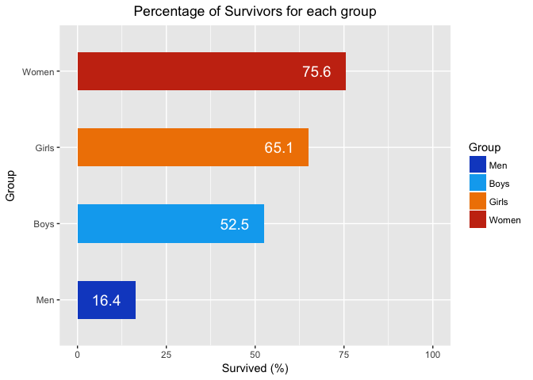
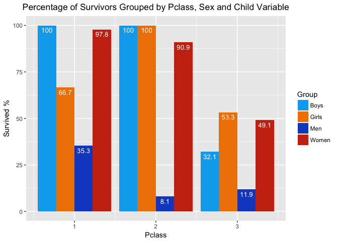
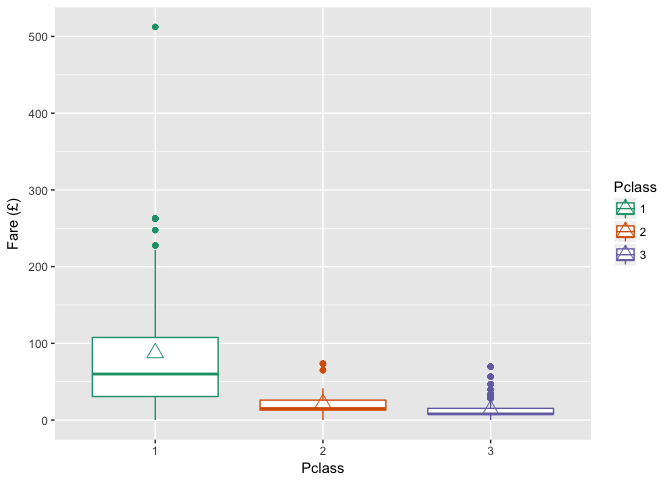
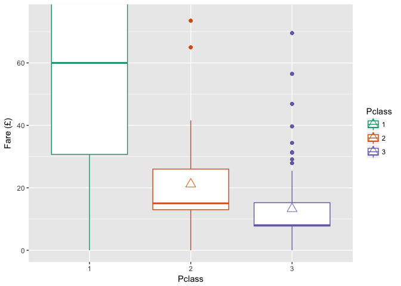
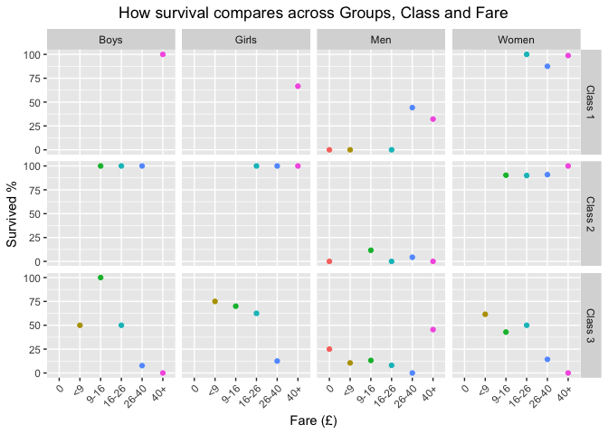
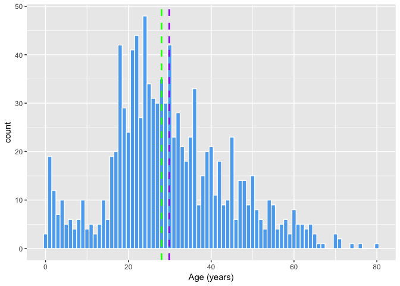
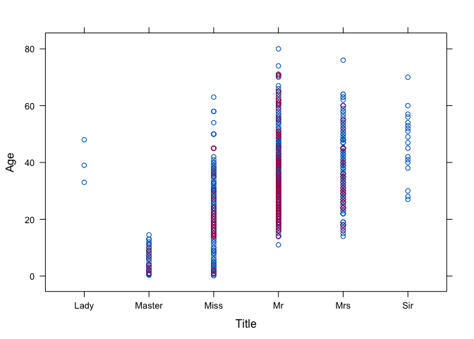
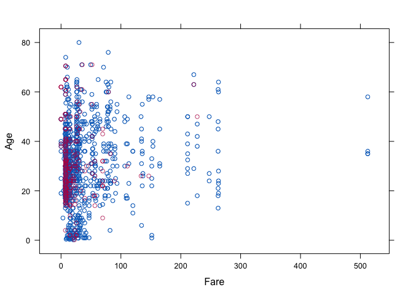
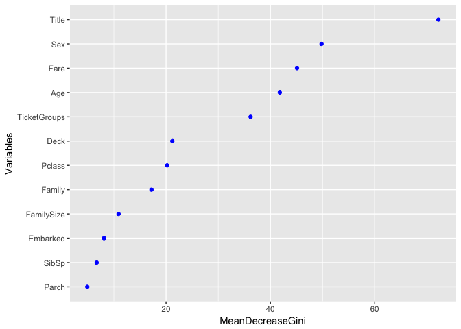

# Titanic Project
Marta Sanowska  
10 October 2017  


# Introduction  
The Titanic competition is my first attempt at machine learning. I chose this particular dataset, as it seems to be a great starting point for many data science newbies.

# Description of the Problem  
The 1912 maiden voyage of the Titanic from England to New York ended in a horrific accident, when the supposedly indestructible ship hit the infamous iceberg and began to sink with all 2224 passengers on board. What became quickly apparent was the lack of lifeboats for all of the passengers, which resulted in chaos when people were scrambling to get off a sinking ship and find space for themselves in a life boat. There was an element of luck involved in surviving the catastrophe, however certain groups were more likely to survive, such as women, children and the upper class. 
The objective is to predict the fate of the Titanic passengers using the basics of machine learning.  
So let's get started!

# Prepare the work environment  
## Acquire the data  
I obtained the data from [Kaggle.com](https://www.kaggle.com/c/titanic).

```r
# Get the training & test datasets and assign them to the appropriate variables
train <- read.csv("~/Documents/Projects/Titanic competition R/train.csv")
test <- read.csv("~/Documents/Projects/Titanic competition R/test.csv")
```
## Load required packages  

```r
# Data manipulation
library(dplyr)
library(tidyr)
library(plyr)
# Data visualization
library(waffle)
library(ggplot2)
library(lattice)
# Missing value imputation
library(mice)
# Prediction models
library(randomForest)
library(party)
```

# Data exploration  
## Structure of the datasets 
Let's explore the structure of both datasets.

```r
# Structure of the train dataset
str(train)
```

```
## 'data.frame':	891 obs. of  12 variables:
##  $ PassengerId: int  1 2 3 4 5 6 7 8 9 10 ...
##  $ Survived   : int  0 1 1 1 0 0 0 0 1 1 ...
##  $ Pclass     : int  3 1 3 1 3 3 1 3 3 2 ...
##  $ Name       : Factor w/ 891 levels "Abbing, Mr. Anthony",..: 109 191 358 277 16 559 520 629 417 581 ...
##  $ Sex        : Factor w/ 2 levels "female","male": 2 1 1 1 2 2 2 2 1 1 ...
##  $ Age        : num  22 38 26 35 35 NA 54 2 27 14 ...
##  $ SibSp      : int  1 1 0 1 0 0 0 3 0 1 ...
##  $ Parch      : int  0 0 0 0 0 0 0 1 2 0 ...
##  $ Ticket     : Factor w/ 681 levels "110152","110413",..: 524 597 670 50 473 276 86 396 345 133 ...
##  $ Fare       : num  7.25 71.28 7.92 53.1 8.05 ...
##  $ Cabin      : Factor w/ 148 levels "","A10","A14",..: 1 83 1 57 1 1 131 1 1 1 ...
##  $ Embarked   : Factor w/ 4 levels "","C","Q","S": 4 2 4 4 4 3 4 4 4 2 ...
```

```r
# Structure of the test dataset
str(test)
```

```
## 'data.frame':	418 obs. of  11 variables:
##  $ PassengerId: int  892 893 894 895 896 897 898 899 900 901 ...
##  $ Pclass     : int  3 3 2 3 3 3 3 2 3 3 ...
##  $ Name       : Factor w/ 418 levels "Abbott, Master. Eugene Joseph",..: 210 409 273 414 182 370 85 58 5 104 ...
##  $ Sex        : Factor w/ 2 levels "female","male": 2 1 2 2 1 2 1 2 1 2 ...
##  $ Age        : num  34.5 47 62 27 22 14 30 26 18 21 ...
##  $ SibSp      : int  0 1 0 0 1 0 0 1 0 2 ...
##  $ Parch      : int  0 0 0 0 1 0 0 1 0 0 ...
##  $ Ticket     : Factor w/ 363 levels "110469","110489",..: 153 222 74 148 139 262 159 85 101 270 ...
##  $ Fare       : num  7.83 7 9.69 8.66 12.29 ...
##  $ Cabin      : Factor w/ 77 levels "","A11","A18",..: 1 1 1 1 1 1 1 1 1 1 ...
##  $ Embarked   : Factor w/ 3 levels "C","Q","S": 2 3 2 3 3 3 2 3 1 3 ...
```
The `read.csv` default argument for importing character vectors is to turn them into factors. It's useful in the case of the "Sex" variable, but not so much in the case of the "Name" variable.  
A few things that I noticed during my initial exploration:  
1. The train dataset contains 891 observations of 12 variables, while the test dataset contains 418 observations of 11 variables. The one column that's missing from the test dataset is the "Survived" column that will be used to build the prediction model.  
2. One of the values for the "Age" column is "NA". We'll explore the variable in more detail later on, in order to check if there are more missing values, and what to do about them.   
3. The "Cabin" and "Embarked" have empty strings; "Cabin" in both datasets, while "Embarked" only in the train dataset.  

Since it will be easier to manipulate the data when the string columns are character vectors, I'll re-upload the datasets again, but set the argument `stringsAsFactors = FALSE`.

```r
# Reload the training & test datasets with the correct setting
train <- read.csv("~/Documents/Projects/Titanic competition R/train.csv", stringsAsFactors = FALSE)
test <- read.csv("~/Documents/Projects/Titanic competition R/test.csv", stringsAsFactors = FALSE)
```

Now we can combine both datasets into one for data exploration.

```r
both_sets <- bind_rows(train, test)
# Check the structure of the new dataset to see if the merge was successful
str(both_sets)
```

```
## 'data.frame':	1309 obs. of  12 variables:
##  $ PassengerId: int  1 2 3 4 5 6 7 8 9 10 ...
##  $ Survived   : int  0 1 1 1 0 0 0 0 1 1 ...
##  $ Pclass     : int  3 1 3 1 3 3 1 3 3 2 ...
##  $ Name       : chr  "Braund, Mr. Owen Harris" "Cumings, Mrs. John Bradley (Florence Briggs Thayer)" "Heikkinen, Miss. Laina" "Futrelle, Mrs. Jacques Heath (Lily May Peel)" ...
##  $ Sex        : chr  "male" "female" "female" "female" ...
##  $ Age        : num  22 38 26 35 35 NA 54 2 27 14 ...
##  $ SibSp      : int  1 1 0 1 0 0 0 3 0 1 ...
##  $ Parch      : int  0 0 0 0 0 0 0 1 2 0 ...
##  $ Ticket     : chr  "A/5 21171" "PC 17599" "STON/O2. 3101282" "113803" ...
##  $ Fare       : num  7.25 71.28 7.92 53.1 8.05 ...
##  $ Cabin      : chr  "" "C85" "" "C123" ...
##  $ Embarked   : chr  "S" "C" "S" "S" ...
```

## Sex  
We know that the Titanic catastrophe was famous for saving women, children and the upper class first. First, let's explore how gender is related to one's chance of survival. 

```r
# % of passengers grouped by Sex
round((prop.table(table(both_sets$Sex))*100), 1)
```

```
## 
## female   male 
##   35.6   64.4
```
Men made up the majority (64%) of passengers on the ship. Now let's check the proportions of those who survived.

```r
# % of passengers grouped by the variables Sex & Survived
round((prop.table(table(both_sets$Sex, both_sets$Survived), 2)*100), 1)
```

```
##         
##             0    1
##   female 14.8 68.1
##   male   85.2 31.9
```
Men do not make up the majority of survivors, even though they were the majority of passengers. I'll use a waffle chart to help visualize these numbers.


```r
# Waffle chart of the comparison
iron(
        waffle(c(female = 36, male = 64), rows = 5, 
               colors = c("#C93414", "#144EC9"), title = "All passengers grouped by Sex (%)"),
        waffle(c(female = 68, male = 32), rows = 5, 
               colors = c("#C93414", "#144EC9"), title = "Survivors grouped by Sex (%)")
)
```

<!-- -->

The top chart illustrates the proportion of all passengers on the Titanic grouped by Sex. The bottom chart shows the proportion of those who survived also grouped by Sex. We can clearly see that women had an advantage over men, even though there were more male passengers. Let's now include children.

## Child  
One thing to keep in mind when filtering out children is that back in 1912 young kids of 12 or 13 were already working in factories full-time! They weren't considered an adult at 12, and had some protection under the law as young workers, but at 16 boys were considered 'men'. Therefore, the more appropriate age to separate the adults from children is 16 years. 

```r
# Filter out the children and create a new variable
both_sets$Child <- 0
both_sets$Child[both_sets$Age < 16] <- 1
```


```r
# Create a proportions table
round((prop.table(ftable(both_sets[c("Sex", "Child", "Survived")]), 1)*100), 1)
```

```
##              Survived    0    1
## Sex    Child                   
## female 0              24.4 75.6
##        1              34.9 65.1
## male   0              83.6 16.4
##        1              47.5 52.5
```
The table shows the survival chances across all four groups. For example, 75.6% of adult females survived, while 24.4% of that group did not.
Let's use a bar graph to help visualize the differences.

```r
# Aggregate the proportions into a data frame
chart <- aggregate(Survived ~ Sex + Child, data=both_sets, FUN=function(x) {round((sum(x)/length(x)*100), 1)})
# Prepare the data frame for ggplot
chart <- unite(chart, "Group", c("Sex", "Child"))
chart[, 1] <- c("Women", "Men", "Girls", "Boys")
chart$Group <- factor(chart$Group, levels = chart$Group[order(chart$Survived)])
chart <- arrange(chart, Group, Survived)
```


```r
# Plot the data frame
ggplot(data=chart, aes(x=Group, y=Survived, fill=Group)) +
        ggtitle("Percentage of Survivors for each group")+
        geom_bar(stat="identity", width=0.5)+
        scale_fill_manual(values=c("#144EC9", "#00ABF0", "#F08300", "#C93414"))+
        geom_text(aes(label=Survived), hjust=1.5, color="white", size=5)+
        scale_y_continuous(name ="Survived (%)")+
        expand_limits(y=c(0,100))+
        coord_flip()+
        theme(plot.title = element_text(hjust = 0.5))
```

<!-- -->

Turns out that overall women had the best chances of survival, followed by girls, boys and then men at the end. The difference between women and men is quite large - women had almost 60% more chance of surviving. However, the difference between female and male children isn't as pronounced as it is between adult females and males when it comes to their chance of survival (12.6% difference vs 59.2%)- male children are at an advantage as compared to adult males, but adult females have an advantage over female children by 10.5%.

## Class  
We learned from the description that the upper class had preferential treatment as well. Let's now check how the survival compares across class. 

```r
round((prop.table(ftable(both_sets[c("Pclass", "Child", "Sex", "Survived")]), 1)*100), 1)
```

```
##                     Survived     0     1
## Pclass Child Sex                        
## 1      0     female            2.2  97.8
##              male             64.7  35.3
##        1     female           33.3  66.7
##              male              0.0 100.0
## 2      0     female            9.1  90.9
##              male             91.9   8.1
##        1     female            0.0 100.0
##              male              0.0 100.0
## 3      0     female           50.9  49.1
##              male             88.1  11.9
##        1     female           46.7  53.3
##              male             67.9  32.1
```
The table becomes a bit difficult to read after another variable was added. A bar graph will be very useful to help visualize the information and compare different groups.


```r
# Aggregate the proportions into a data frame
chart2 <- aggregate(Survived ~ Child + Sex + Pclass, data=both_sets, FUN=function(x) {round((sum(x)/length(x)*100), 1)})
# Prepare the data frame for ggplot
chart2 <- unite(chart2, "Group", c("Sex", "Child"))
chart2$Group <- mapvalues(chart2$Group, from = c("female_0", "female_1", "male_0", "male_1"), to = c("Women", "Girls", "Men", "Boys"))
```


```r
# Plot the data frame
ggplot(data=chart2, aes(x=Pclass, y=Survived, fill=Group)) +
        ggtitle("Percentage of Survivors Grouped by Pclass, Sex and Child Variable")+
        geom_bar(stat="identity", position=position_dodge(), width=0.9)+
        scale_fill_manual(values=c("#00ABF0", "#F08300", "#144EC9", "#C93414"))+
        geom_text(aes(label=Survived), position = position_dodge(0.9), vjust=1.5, hjust=0.5, color="white", size=3.5)+
        scale_y_continuous(name ="Survived %")+
        theme(plot.title = element_text(hjust = 0.5))
```

<!-- -->

We can clearly see the difference class makes - adult females had the best chance of survival if they were travelling 1st class and the worst if they were in the 3rd (from 97.8% chance of survival the number goes down to 49.1%). Men had the best chances of survival when traveling in 1st class - even slightly better chances than boys in the 3rd class.   Interesting. Female children from 1st class had only 66.67% chance of survival, while the rest of the children in 1st and 2nd class were saved. What happened to those unlucky girls from first class?

```r
na.omit(both_sets[both_sets$Survived==0 & both_sets$Pclass==1 & both_sets$Child==1, ])
```

```
##     PassengerId Survived Pclass                         Name    Sex Age
## 298         298        0      1 Allison, Miss. Helen Loraine female   2
##     SibSp Parch Ticket   Fare   Cabin Embarked Child
## 298     1     2 113781 151.55 C22 C26        S     1
```
There weren't many children in the 1st class and the only one who wasn't saved was Miss Helen Loraine Allison, traveling with one sibling and both parents. Let's check what happened to the rest of her family.

```r
both_sets[both_sets$Ticket==113781, ]
```

```
##      PassengerId Survived Pclass
## 298          298        0      1
## 306          306        1      1
## 499          499        0      1
## 709          709        1      1
## 1033        1033       NA      1
## 1198        1198       NA      1
##                                                 Name    Sex   Age SibSp
## 298                     Allison, Miss. Helen Loraine female  2.00     1
## 306                   Allison, Master. Hudson Trevor   male  0.92     1
## 499  Allison, Mrs. Hudson J C (Bessie Waldo Daniels) female 25.00     1
## 709                             Cleaver, Miss. Alice female 22.00     0
## 1033                            Daniels, Miss. Sarah female 33.00     0
## 1198            Allison, Mr. Hudson Joshua Creighton   male 30.00     1
##      Parch Ticket   Fare   Cabin Embarked Child
## 298      2 113781 151.55 C22 C26        S     1
## 306      2 113781 151.55 C22 C26        S     1
## 499      2 113781 151.55 C22 C26        S     0
## 709      0 113781 151.55                S     0
## 1033     0 113781 151.55                S     0
## 1198     2 113781 151.55 C22 C26        S     0
```
Looks like two other people travelled with the Allison family on the same ticket - the two women were most likely employed by them. We see that Miss Helen's mother did not make it off the ship either, despite having all the advantages of being a woman in the 1st class (with 97.8% survival chance), while her other child baby Hudson Trevor, and Miss. Cleaver were saved.  
Upon further investigation on [Encyclopedia Titanica](www.encyclopedia-titanica.org) I found out that in the chaos that ensued after the collision, Miss Cleaver took baby Trevor and boarded a lifeboat, while Mr. and Mrs. Allison stayed behind with their daughter, because they couldn't find their son and didn't want to leave without him, unaware that he had been saved.  

Back to the analysis. Despite all the benefits of being 1st class passengers, the majority of the Allison family didn't make it. It's possible that the family variable could be a strong indicator in predicting whether or not a family survives in other cases as well. It would be a good idea to create a "Family" variable when we do feature engineering.

## Fare  
We know that the class that the passenger found him/herself in made a huge difference on their chance of surviving. Now let's check how the fare that they paid contributes to their chances.

```r
# Check the summary of the Fare distribution across class
tapply(both_sets$Fare, both_sets$Pclass, summary)
```

```
## $`1`
##    Min. 1st Qu.  Median    Mean 3rd Qu.    Max. 
##    0.00   30.70   60.00   87.51  107.66  512.33 
## 
## $`2`
##    Min. 1st Qu.  Median    Mean 3rd Qu.    Max. 
##    0.00   13.00   15.05   21.18   26.00   73.50 
## 
## $`3`
##    Min. 1st Qu.  Median    Mean 3rd Qu.    Max.    NA's 
##    0.00    7.75    8.05   13.30   15.25   69.55       1
```
Here we have a summary of the Fare variable split by class. At first glance, we can see that the ticket prices between 2nd and 3rd class are not that different from each other (2nd class being slightly more expensive), but that there's a significant gap between the 1st class and 2nd class. A boxplot should be helpful in visualizing the differences.  
Also, there is one missing value that I'll fix later, along with other missing values for other variables. 

```r
# Set Pclass as a factor
both_sets$Pclass <- factor(both_sets$Pclass)
# Create a boxplot
ggplot(both_sets, aes(x=Pclass, y=Fare, color=Pclass)) +
        geom_boxplot(fill="white", position="dodge")+
        theme(legend.position="right")+
        labs(y = "Fare (£)")+
        scale_color_brewer(palette="Dark2")+
        stat_summary(fun.y=mean, geom="point", shape=2, size=4)
```

```
## Warning: Removed 1 rows containing non-finite values (stat_boxplot).
```

```
## Warning: Removed 1 rows containing non-finite values (stat_summary).
```

<!-- -->

We can see that the difference in ticket prices between 1st class and the rest is quite large, while class 2 and 3 did not differ substantially. I will zoom in on class 2 and 3 in order to be able to see the details more clearly.

```r
ggplot(both_sets, aes(x=Pclass, y=Fare, color=Pclass)) +
        geom_boxplot(fill="white", position="dodge")+
        theme(legend.position="right")+
        labs(y = "Fare (£)")+
        scale_color_brewer(palette="Dark2")+
        stat_summary(fun.y=mean, geom="point", shape=2, size=4)+
        coord_cartesian(ylim=c(0, 75))
```

```
## Warning: Removed 1 rows containing non-finite values (stat_boxplot).
```

```
## Warning: Removed 1 rows containing non-finite values (stat_summary).
```

<!-- -->

The horizontal line inside the boxplot represents the median, while the triangle represents the mean for each class. There are two outliers in the 2nd class who paid for their ticket as much as the majority of passengers in the 1st class, and a few people in the 3rd class who paid more than £25, which is the 3rd quartile of the 2nd class.
I'm interested to see if those who paid the highest fares in 2nd and 3rd class had better chances of surviving as compared to the rest of the passengers in those two classes.

Another point to make is that the minimum fare for each class starts at £0.00, which means that some people travelled for free on the ship. Those were most likely crew members who were working on the Titanic, such as engineers, cooks etc. How did their survival chance compared to the chances of paying passengers?


```r
# Split the Fare variable into intervals
both_sets$Fare1[both_sets$Fare == 0] <- '0'
both_sets$Fare1[both_sets$Fare > 0 & both_sets$Fare < 9] <- '<9'
both_sets$Fare1[both_sets$Fare >= 9 & both_sets$Fare < 16] <- '9-16'
both_sets$Fare1[both_sets$Fare >= 16 & both_sets$Fare < 26] <- '16-26'
both_sets$Fare1[both_sets$Fare >= 26 & both_sets$Fare < 40] <- '26-40'
both_sets$Fare1[both_sets$Fare >= 40] <- '40+'
```


```r
# Aggregate the proportions into a data frame
chart3 <- aggregate(Survived ~ Pclass + Fare1 + Sex + Child, data=both_sets, FUN=function(x) {sum(x)/length(x)*100})
chart3
```

```
##    Pclass Fare1    Sex Child   Survived
## 1       3    <9 female     0  61.538462
## 2       1 16-26 female     0 100.000000
## 3       2 16-26 female     0  90.000000
## 4       3 16-26 female     0  50.000000
## 5       1 26-40 female     0  87.500000
## 6       2 26-40 female     0  90.909091
## 7       3 26-40 female     0  14.285714
## 8       1   40+ female     0  98.765432
## 9       2   40+ female     0 100.000000
## 10      3   40+ female     0   0.000000
## 11      2  9-16 female     0  90.322581
## 12      3  9-16 female     0  42.857143
## 13      1    <9   male     0   0.000000
## 14      3    <9   male     0  10.548523
## 15      1     0   male     0   0.000000
## 16      2     0   male     0   0.000000
## 17      3     0   male     0  25.000000
## 18      1 16-26   male     0   0.000000
## 19      2 16-26   male     0   0.000000
## 20      3 16-26   male     0   8.000000
## 21      1 26-40   male     0  44.230769
## 22      2 26-40   male     0   4.347826
## 23      3 26-40   male     0   0.000000
## 24      1   40+   male     0  32.203390
## 25      2   40+   male     0   0.000000
## 26      3   40+   male     0  45.454545
## 27      2  9-16   male     0  11.666667
## 28      3  9-16   male     0  13.157895
## 29      3    <9 female     1  75.000000
## 30      2 16-26 female     1 100.000000
## 31      3 16-26 female     1  62.500000
## 32      2 26-40 female     1 100.000000
## 33      3 26-40 female     1  12.500000
## 34      1   40+ female     1  66.666667
## 35      2   40+ female     1 100.000000
## 36      3  9-16 female     1  70.000000
## 37      3    <9   male     1  50.000000
## 38      2 16-26   male     1 100.000000
## 39      3 16-26   male     1  50.000000
## 40      2 26-40   male     1 100.000000
## 41      3 26-40   male     1   7.692308
## 42      1   40+   male     1 100.000000
## 43      3   40+   male     1   0.000000
## 44      2  9-16   male     1 100.000000
## 45      3  9-16   male     1 100.000000
```
The data frame gets overwhelming to read with so many variables. I'll use a scatterplot with facets for easier comparison across different groups and variables. 

```r
# Merge Sex and Child Variable to create 4 groups for Men, Women, Girls and Boys
chart3 <- unite(chart3, "Group", c("Sex", "Child"))
chart3$Group <- mapvalues(chart3$Group, from = c("female_0", "female_1", "male_0", "male_1"), to = c("Women", "Girls", "Men", "Boys"))
```


```r
# Convert Fare1 to a factor, check the order of the levels
chart3$Fare1 <- factor(chart3$Fare1)
print(levels(chart3$Fare1))
```

```
## [1] "<9"    "0"     "16-26" "26-40" "40+"   "9-16"
```

```r
# Rearrange the order
chart3$Fare1 <- factor(chart3$Fare1,levels(chart3$Fare1)[c(2,1,6,3,4,5)])
# Check if correct
print(levels(chart3$Fare1))
```

```
## [1] "0"     "<9"    "9-16"  "16-26" "26-40" "40+"
```


```r
# Plot the data frame
levels(chart3$Pclass) <- c("Class 1", "Class 2", "Class 3")
ggplot(chart3, aes(x=Fare1, y=Survived, col=Fare1))+
        geom_point()+
        ggtitle("How survival compares across Groups, Class and Fare")+
        facet_grid(Pclass~Group)+
        labs(x = "Fare (£)", y="Survived %")+
        theme(plot.title = element_text(hjust = 0.5),
              axis.text.x = element_text(angle=45, hjust=1),
              legend.position = "none")
```

<!-- -->

Now we're able to see trends across different population groups, classes and fare segments. For instance, we can easily compare the survival chances of men who paid £40+ across all three classes, and we can see that in this case men from the 3rd class had better chances than men from both the 1st and 2nd class. We can also see that women who paid more than £40 in the 3rd class had the worst outcome, followed by those who paid between £26-40, which is the opposite of my original assumption. The crew wasn't so lucky either, with an exception in the 3rd class, where the chances were 25% - upon taking another look, it turns out that it was only one person who got lucky.

# Data transformation  
## Fare
There is only one missing value for that variable. Let's see which one.

```r
which(is.na(both_sets$Fare))
```

```
## [1] 1044
```

```r
both_sets[1044, ]
```

```
##      PassengerId Survived Pclass               Name  Sex  Age SibSp Parch
## 1044        1044       NA      3 Storey, Mr. Thomas male 60.5     0     0
##      Ticket Fare Cabin Embarked Child Fare1
## 1044   3701   NA              S     0  <NA>
```
Mr. Storey travelled alone in the 3rd class. Let's fill in the missing value with the median of that class.

```r
both_sets$Fare[1044] <- median(na.omit(both_sets$Fare[both_sets$Pclass==3]))
```
Let's check if the value was fixed properly.

```r
both_sets[1044, ]
```

```
##      PassengerId Survived Pclass               Name  Sex  Age SibSp Parch
## 1044        1044       NA      3 Storey, Mr. Thomas male 60.5     0     0
##      Ticket Fare Cabin Embarked Child Fare1
## 1044   3701 8.05              S     0  <NA>
```

## Deck code  
I wonder if the deck that a passenger was located on had an impact on that person's survival chances. The majority of the fields are missing, but maybe it will be helpful in predicting the fate for those who had that cabin number filled in. 

```r
# Extract the first letter from the cabin numbers
both_sets$Deck <- sapply(both_sets$Cabin, FUN=function(x) {strsplit(x, split='')[[1]][1]})
```


```r
# Check the distribution of the deck levels
table(both_sets$Deck)
```

```
## 
##  A  B  C  D  E  F  G  T 
## 22 65 94 46 41 21  5  1
```
Since Decks "G" and "T" are not that common, we should merge them based on how the letters are distributed across class.  

```r
table(both_sets$Deck, both_sets$Pclass)
```

```
##    
##      1  2  3
##   A 22  0  0
##   B 65  0  0
##   C 94  0  0
##   D 40  6  0
##   E 34  4  3
##   F  0 13  8
##   G  0  0  5
##   T  1  0  0
```
Everyone who stayed on the "G" level travelled 3rd class, therefore I will merge them with the "F" class. The person staying on the "T" deck travelled 1st class, therefore I'll combine the "T" deck with the "C" deck where most people from the 1st class were located.


```r
# Fix the deck letters
both_sets$Deck[both_sets$Deck=="G"] <- "F"
both_sets$Deck[both_sets$Deck=="T"] <- "C"
# Check if the changes were made correctly
table(both_sets$Deck)
```

```
## 
##  A  B  C  D  E  F 
## 22 65 95 46 41 26
```


```r
# Change the NA values to 0, because Random Forest doesn't handle missing values
both_sets <- both_sets %>%
     mutate(Deck=replace(Deck, is.na(Deck), 0))
```


```r
# Convert the Deck variable into a factor
both_sets$Deck <- factor(both_sets$Deck)
```


## Embarked  
In this case `is.na()` won't work, because the fields are not NA's, but rather empty strings "".

```r
# Check which "Embarked" values are missing
which(both_sets$Embarked=="")
```

```
## [1]  62 830
```

```r
# Print the rows with missing "Embarked" values
both_sets[c(62, 830), ]
```

```
##     PassengerId Survived Pclass                                      Name
## 62           62        1      1                       Icard, Miss. Amelie
## 830         830        1      1 Stone, Mrs. George Nelson (Martha Evelyn)
##        Sex Age SibSp Parch Ticket Fare Cabin Embarked Child Fare1 Deck
## 62  female  38     0     0 113572   80   B28              0   40+    B
## 830 female  62     0     0 113572   80   B28              0   40+    B
```
Let's check where did other passengers board who were also in the first class, paid more than 40 pounds for their ticket and who were also located on the "B" deck of the ship.

```r
otherTickets <- na.omit(both_sets[both_sets$Fare1 =="40+" & both_sets$Pclass==1 & both_sets$Deck=="B", ])
table(otherTickets$Embarked)
```

```
## 
##     C  S 
##  2 18 17
```
18 passengers boarded in Cherbourg, France and 17 in Southampton, England therefore it's almost an even split. Since Mrs. Stone has an English last name, is married, and is older than her travel companion Miss. Icard, I'm going to take a guess that they boarded in Southampton.

```r
both_sets$Embarked[c(62, 830)] <- "S"
# Check if changes were made correctly
both_sets[c(62, 830), ]
```

```
##     PassengerId Survived Pclass                                      Name
## 62           62        1      1                       Icard, Miss. Amelie
## 830         830        1      1 Stone, Mrs. George Nelson (Martha Evelyn)
##        Sex Age SibSp Parch Ticket Fare Cabin Embarked Child Fare1 Deck
## 62  female  38     0     0 113572   80   B28        S     0   40+    B
## 830 female  62     0     0 113572   80   B28        S     0   40+    B
```

```r
# Convert Embarked variable to a factor
both_sets$Embarked <- factor(both_sets$Embarked)
```

## Title  
We know that age and status played a major role in predicting a passenger's fate. Titles are a way of indicating both. For instance, young boys used to be called "Masters", while men were addressed as "Mister". Let's check the distribution of titles and whether the person is an adult or a child.

```r
# Extract titles from names
both_sets$Title <- sapply(both_sets$Name, FUN=function(x) {strsplit(x, split='[,.]')[[1]][2]})
both_sets$Title <- sub(" ", "", both_sets$Title)
# Explore titles and age
ftable(both_sets$Child, both_sets$Title)
```

```
##    Capt Col Don Dona  Dr Jonkheer Lady Major Master Miss Mlle Mme  Mr Mrs  Ms Rev Sir the Countess
##                                                                                                   
## 0     1   4   1    1   8        1    1     2      8  206    2   1 751 195   2   8   1            1
## 1     0   0   0    0   0        0    0     0     53   54    0   0   6   2   0   0   0            0
```
Looks like my assumptions were mostly correct, with a few exceptions in the "Master", "Mr.", and "Mrs." column. Let's look at how are titles distributed across the "Sex" variable.

```r
ftable(both_sets$Sex, both_sets$Title)
```

```
##         Capt Col Don Dona  Dr Jonkheer Lady Major Master Miss Mlle Mme  Mr Mrs  Ms Rev Sir the Countess
##                                                                                                        
## female     0   0   0    1   1        0    1     0      0  260    2   1   0 197   2   0   0            1
## male       1   4   1    0   7        1    0     2     61    0    0   0 757   0   0   8   1            0
```
Surprisingly, there was one female doctor aboard the Titanic. Also, we now know that a "Jonkheer" is a male title. There are few titles that could be grouped together, for instance "Miss", "Ms", and the French equivalent of "Mlle" all mean the same thing. Let's group those together, so that we have less categories to deal with.

```r
# Group titles by the same category
both_sets$Title[both_sets$Title %in% c("Miss", "Mlle", "Ms")] <- "Miss"
both_sets$Title[both_sets$Title %in% c("Mrs", "Mme")] <- "Mrs"
both_sets$Title[both_sets$Title %in% c("Capt", "Col", "Don", "Jonkheer", "Major", "Rev", "Sir")] <- "Sir"
both_sets$Title[both_sets$Title %in% c("Dona", "Lady", "the Countess")] <- "Lady"
both_sets$Title[both_sets$Title %in% c("Dr") & both_sets$Sex=="female"] <- "Mrs"
both_sets$Title[both_sets$Title %in% c("Dr") & both_sets$Sex=="male"] <- "Mr"
# Convert Title variable to a factor
both_sets$Title <- as.factor(both_sets$Title)
```

## Family  
In the beginning of data exploration we discovered that family could have a significant impact on the chance of survival. Let's group the passengers by the size of their families, and in cases of 4 or more family passengers travelling together, leave those individual families as separate levels.

```r
# Create a variable "FamilySize"
both_sets$FamilySize <- both_sets$SibSp + both_sets$Parch + 1

# Extract last names to form "LastName" variable
both_sets$LastName <- sapply(both_sets$Name, FUN=function(x) {strsplit(x, split='[,.]')[[1]][1]})

# Combine last names and family size to form families
both_sets$Family <- paste(as.character(both_sets$FamilySize), both_sets$LastName, sep=" ")
FamilyTable <- data.frame(table(both_sets$Family))

# Separate passengers by single, small families, and leave the large families as they are
both_sets <- both_sets %>%
        mutate(Family=replace(Family, FamilySize==1, "Single"))

both_sets <- both_sets %>%
        mutate(Family=replace(Family, FamilySize==2 | FamilySize==3, "Small"))

# Convert to a factor
both_sets$Family <- factor(both_sets$Family)
str(both_sets$Family)
```

```
##  Factor w/ 32 levels "11 Sage","4 Allison",..: 32 32 31 32 31 31 31 21 32 32 ...
```

## Ticket  
Another way that tells us whether people travelled together was the same ticket number. Let's see how many unique values there are for the "Ticket" variable.

```r
n_distinct(both_sets$Ticket)
```

```
## [1] 929
```
Let's do a similar grouping within the "Ticket" variable, as we did with the "Family" variable. 

```r
# Create a new data frame with frequencies of each ticket
TicketFreq <- data.frame(table(both_sets$Ticket))
# Create a new column combining the ticket number and how many times it repeats
TicketFreq$TicketGroups <- paste(as.character(TicketFreq$Var1), TicketFreq$Freq, sep=" ")
# Rename the first column so that this data frame can be combined with both_sets
TicketFreq <- dplyr::rename(TicketFreq, Ticket = Var1)
both_sets <- left_join(x = both_sets, y = TicketFreq, by="Ticket")
```

```
## Warning: Column `Ticket` joining character vector and factor, coercing into
## character vector
```

```r
# Separate values into different groups
both_sets <- both_sets %>%
     mutate(TicketGroups=replace(TicketGroups, Freq==1, "unique"))

both_sets <- both_sets %>%
     mutate(TicketGroups=replace(TicketGroups, Freq==2, "pair"))

both_sets <- both_sets %>%
     mutate(TicketGroups=replace(TicketGroups, Freq==3, "groupof3"))

# Set the variable as a factor
both_sets$TicketGroups <- factor(both_sets$TicketGroups)
str(both_sets$TicketGroups)
```

```
##  Factor w/ 38 levels "113503 5","113760 4",..: 36 28 36 28 36 36 28 17 26 28 ...
```

## Age  
Let's explore the Age variable in more detail and check how many missing values there are in the dataset.

```r
summary(both_sets$Age)
```

```
##    Min. 1st Qu.  Median    Mean 3rd Qu.    Max.    NA's 
##    0.17   21.00   28.00   29.88   39.00   80.00     263
```

```r
ggplot(both_sets, aes(x=Age)) +
        geom_histogram(binwidth=1, color="white", fill="steelblue2") +
        labs(x="Age (years)")+
        geom_vline(aes(xintercept=mean(Age, na.rm=TRUE)), color="purple", linetype="dashed", size=1, show.legend = TRUE) +
        geom_vline(aes(xintercept=median(Age, na.rm=TRUE)), color="green", linetype="dashed", size=1, show.legend = TRUE)
```

```
## Warning: Removed 263 rows containing non-finite values (stat_bin).
```

<!-- -->

The green line is the median, and the purple line is the mean. Looks like the majority of people were in their twenties. The summary function states that there are 263 missing values in the "Age" variable. That's a lot of missing values that can't be simply fixed individually, like the "Fare" or the "Embarked" variable.

Let's use the MICE package (Multivariate Imputation by Chained Equations) to impute the missing values.

```r
# use the MICE package to impute missing Age values using only the desired variables
missingAge <- mice(both_sets[, c("Age", "Pclass", "Sex", "SibSp", "Parch", "Fare", "Embarked", "Title" )], m = 1, method ='cart', seed = 78956, printFlag=FALSE)
```

Let's check the density plot of the imputed values, and how they compare with the original values.

```r
# Check the density plot of the imputed values (in red) with the original values (in blue)
densityplot(missingAge, ~Age)
```

<!-- -->

We know that there is a correlation between "Title" and "Age" variables, as we saw earlier when inspecting titles across "Age" and "Sex" variables. There should also be a relationship between "Fare" and "Age" variables, as children paid less for their tickets than adults did. Let's use the lattice package to see how the imputed values correspond to the original values across those two categories. 

```r
# Check how the imputed values (in red) compare with the original values (in blue) across the 
# Title variable
xyplot(missingAge, Age ~ Title)
```

<!-- -->

```r
# Check how the imputed values (in red) compare with the original values (in blue) across the 
# Fare variable
xyplot(missingAge, Age ~ Fare)
```

<!-- -->

Both plots look reasonable. Finally, let's check the summary statistic.


```r
# Get back the completed dataset
agePrediction <- complete(missingAge)
# Check the distribution of the predicted Age variable and compare it with the original
# Original
summary(both_sets$Age)
```

```
##    Min. 1st Qu.  Median    Mean 3rd Qu.    Max.    NA's 
##    0.17   21.00   28.00   29.88   39.00   80.00     263
```

```r
# Predicted
summary(agePrediction$Age)
```

```
##    Min. 1st Qu.  Median    Mean 3rd Qu.    Max. 
##    0.17   21.00   28.00   29.94   38.00   80.00
```
Looks like distribution of the imputed values is a match for the distribution of the original values. Let's go ahead and merge the imputed values with the original dataset. 

```r
# Merge the Prediction with the original dataset
both_sets$Age <- agePrediction$Age
```

# Prediction 
## Random Forest  
Random Forest is one of the packages used in classification problems. Its advantages are that it is simple to implement, and allows us to check feature importance. 
We've done a lot of feature engineering and missing value imputations. Let's check the structure of our current dataset to see the changes.

```r
str(both_sets)
```

```
## 'data.frame':	1309 obs. of  21 variables:
##  $ PassengerId : int  1 2 3 4 5 6 7 8 9 10 ...
##  $ Survived    : int  0 1 1 1 0 0 0 0 1 1 ...
##  $ Pclass      : Factor w/ 3 levels "1","2","3": 3 1 3 1 3 3 1 3 3 2 ...
##  $ Name        : chr  "Braund, Mr. Owen Harris" "Cumings, Mrs. John Bradley (Florence Briggs Thayer)" "Heikkinen, Miss. Laina" "Futrelle, Mrs. Jacques Heath (Lily May Peel)" ...
##  $ Sex         : chr  "male" "female" "female" "female" ...
##  $ Age         : num  22 38 26 35 35 32 54 2 27 14 ...
##  $ SibSp       : int  1 1 0 1 0 0 0 3 0 1 ...
##  $ Parch       : int  0 0 0 0 0 0 0 1 2 0 ...
##  $ Ticket      : chr  "A/5 21171" "PC 17599" "STON/O2. 3101282" "113803" ...
##  $ Fare        : num  7.25 71.28 7.92 53.1 8.05 ...
##  $ Cabin       : chr  "" "C85" "" "C123" ...
##  $ Embarked    : Factor w/ 3 levels "C","Q","S": 3 1 3 3 3 2 3 3 3 1 ...
##  $ Child       : num  0 0 0 0 0 0 0 1 0 1 ...
##  $ Fare1       : chr  "<9" "40+" "<9" "40+" ...
##  $ Deck        : Factor w/ 7 levels "0","A","B","C",..: 1 4 1 4 1 1 6 1 1 1 ...
##  $ Title       : Factor w/ 6 levels "Lady","Master",..: 4 5 3 5 4 4 4 2 5 5 ...
##  $ FamilySize  : num  2 2 1 2 1 1 1 5 3 2 ...
##  $ LastName    : chr  "Braund" "Cumings" "Heikkinen" "Futrelle" ...
##  $ Family      : Factor w/ 32 levels "11 Sage","4 Allison",..: 32 32 31 32 31 31 31 21 32 32 ...
##  $ Freq        : int  1 2 1 2 1 1 2 5 3 2 ...
##  $ TicketGroups: Factor w/ 38 levels "113503 5","113760 4",..: 36 28 36 28 36 36 28 17 26 28 ...
```
We have to convert some variables into factors to be able to use them with Random Forest. Let's do that now.

```r
# Change variables that will be used into factors
library(dplyr) 
both_sets <- both_sets %>%
    mutate(
        Survived = as.factor(Survived),
        Sex = as.factor(Sex),
        SibSp = as.factor(SibSp),
        Parch = as.factor(Parch),
        Fare1 = as.factor(Fare1)
    )
```


```r
# Spit the train and test datasets
train <- both_sets[1:891, ]
test <- both_sets[892:1309, ]
```


```r
# Use the Random Forest model for prediciton
set.seed(190340)
fit <- randomForest(as.factor(Survived) ~ Pclass + Sex + Age + SibSp + Parch + Fare + Embarked + Deck + Title + FamilySize + Family + TicketGroups,
                    data=train,
                    importance=TRUE,
                    ntree=2000)
```

Let's see what variables were important in the model.

```r
# Inspect the Importance of each variable
data <- as.data.frame(cbind(rownames(fit$importance), round(fit$importance[,"MeanDecreaseGini"], 1)))
colnames(data) <- c("Variables","MeanDecreaseGini")
data$MeanDecreaseGini <- as.numeric(as.character(data$MeanDecreaseGini))
data$Variables <- factor(data$Variables, levels = data$Variables[order(data$MeanDecreaseGini)])
# Plot the Importance using ggplot
ImportancePlot <- ggplot(data) + 
        geom_point(aes(MeanDecreaseGini,Variables), colour="blue")
ImportancePlot
```

<!-- -->

"Title", "Sex", and "Fare" are the top three most important variables that affect the outcome. It's not surprising since we knew that from earlier exploratory data analysis that women and children did have better outcomes than men and adults. "TicketGroups" and "Deck", the two engineered variables are doing quite nicely, as well as the "Family" variable.

Let's submit the prediction into Kaggle!

```r
Prediction <- predict(fit, test)
submit <- data.frame(PassengerId = test$PassengerId, Survived = Prediction)
write.csv(submit, file = "RF Prediction 1", row.names = FALSE)
# Score: 0.71291
```
That's not such a great score. The least important variables might be causing noise in the model. I'll delete the last three and try again.

```r
# Remove the 3 least important variables & try different settings
set.seed(897654)
fit <- randomForest(as.factor(Survived) ~ Pclass + Sex + Age + Fare + Deck + Title + FamilySize + Family + TicketGroups,
                    data=train,
                    importance=TRUE,
                    mtry=2,
                    nodesize=3,
                    ntree=2001)
```


```r
# Submit the new prediction
Prediction <- predict(fit, test)
submit <- data.frame(PassengerId = test$PassengerId, Survived = Prediction)
write.csv(submit, file = "RF Prediction 2", row.names = FALSE)
# Score: 0.70813
```
That's a worse score than before. Some of the drawbacks of the Random Forest model is that it tends to be biased towards continuous variables and variables with many categories (some of the variables in the data frame have over 30 levels and both "Age" and "Fare" are continuous).

## CForest
The CForest function from the "party" package uses the same algorithm as Random Forest, but it also uses weighted average of the trees to get the final result. 

```r
# Try the cforest function the party package
set.seed(6690)
cfit <- cforest(as.factor(Survived) ~ Pclass + Sex + Age + Fare + Deck + Title + FamilySize + Family + TicketGroups,
               data=train,
               controls=cforest_unbiased(ntree=2000, mtry=3))
```


```r
# Submit the Prediction
Prediction2 <- predict(cfit, test, OOB=TRUE, type = "response")
submit <- data.frame(PassengerId = test$PassengerId, Survived = Prediction2)
write.csv(submit, file = "Final prediction.csv", row.names = FALSE)
#Score: 0.81339
```
That's much better! At the time of writing this, I'm in the top 5% of the competition.

# Conclusion  
The Titanic dataset is a great start to learn about data munging and some basics about machine learning. There's much more to learn about creating and tuning models, and I've only made some basic adjustments to the ntree and mtry variables. During my search I discovered gradient boosting, ensemble models, and how you could use functions to check for optimal settings or the best model for a particular problem, however those are topics that I'll explore later. For now that's my best score, and hopefully once I continue learning more about machine learning I'll be able to create a more accurate prediction in this competition.  

Feedback is much appreciated!  
